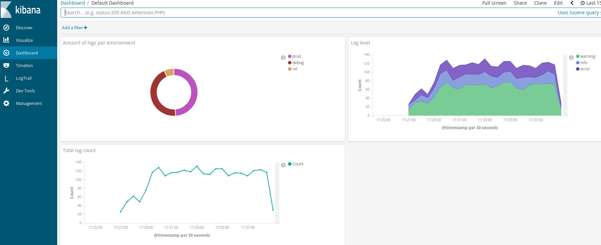
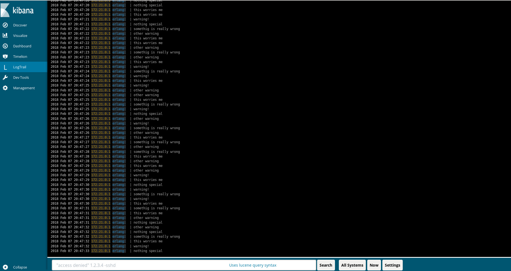

# erlang_log_to_kibana
Demonstration of how to setup Elastic Search, Kibana, Logstash and
Logtrail, with Erlang lager.

## production script
See the [production script](ops/production).

## ops
See [how the ops works](ops/).

## testing

- `make ops` starts every service and initializes kibana.
- `make test-env1` and `make test-env2` starts an erlang application that
  generates random logs.

You can see the logged data at `http://localhost:5601/` and click in 'Dashboard'.
If the status of kibana is RED saying something about outdated indexes is
because the default configuration is still being uploaded, wait 5 to 20 seconds
and reload the page.
